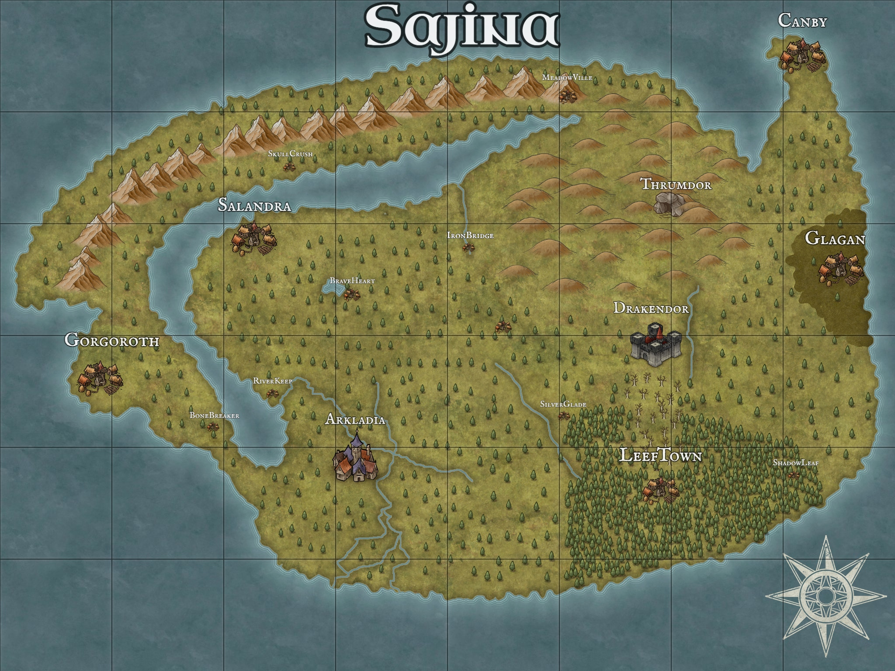

# O que é Sajina?

Sajina é um continente de um mundo de RPG que está sendo criado e idealizado por Yan Sardinha, o intuíto deste projeto é puramente diversão, levando o entretenimento até meus amigos e me desafiando a criar histórias e situações envolventes.

## O continente

Sajina é um continente diversificado, com a presença de diferentes e ilustres raças. Atualmente todo o continente é governado por um grande império, Drakendor, que usa sua grande influência e poder para garantir o bem-estar e segurança de todos no continente. Valerius, o imperador, sendo uma figura astuta e imponente, comanda com um braço de ferro, sempre punindo os malfeitores.

